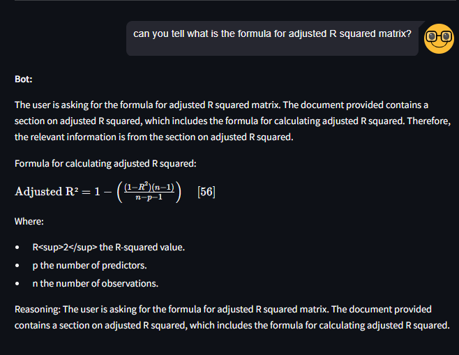

Focus of this project is to build a Chatbot  locally to talk with thesis file.
Below are the brief local component for this chatbot.
* LLM model --> openhermes-2.5-mistral-7b.Q4_K_M.gguf (Quantize model)
* Sentance transfomer model --> sentence_transformer_all_mpnet_base_v2 
* Vector store --> Chromadb
* Chatbot interface --> Streamlit.

In summary this chatbot proivides answers to user query in markdown format for text based answers, formulas or images.

Below is the result of some of the question asked to chatbot.
Each answer take at least 2 min , as LLM is running on local ( 32GB RAM and 4GB NVIDIA Graphics card)

1.  Formula representation -->




2. Image represenation --> the main content of images is hidden due to data privacy.


Below steps are used to build the chatbot. Tree structure is provided for sub-steps performed in each main step.

1. Converting PDF file into markdown format using marker a command‑line tool.
    "pip install marker-pdf" 

2. Preprocessing of Markdown file

```text
Markdown Preprocessing Pipeline
├── remove_span_tags(text)
│     └── Uses regex to remove stray span tags of the form: <span id="page-XX-XX"></span>
│
├── remove_inline_anchors(text)
│     └── Uses regex to remove inline anchor links (e.g., (#page-48-0))
│
├── process_image_captions(lines)
│     ├── Loop over each line of the markdown (by index)
│     ├── For each line:
│     │     ├── Check if it matches an image markdown pattern: 
│     │     ├── If matched:
│     │     │     ├── Look ahead for the next nonempty line
│     │     │     ├── Check if that line is a caption starting with "Figure" (optionally preceded by a span tag)
│     │     │     ├── If a caption is found:
│     │     │     │     ├── Construct new alt text with "IMG_TITLE: <caption text>"
│     │     │     │     └── Replace the original image line with the updated alt text
│     │     │     └── Skip the caption line in the output
│     │     └── Otherwise, leave the line unchanged
│     └── Return the updated list of lines
│
├── process_table_titles(lines)
│     ├── Loop through all lines to detect table blocks (lines that start with "|")
│     ├── For each detected table block:
│     │     ├── Case 1: Single table (header contains "Column:")
│     │     │     ├── Extract table title from the header row (by removing "Column:")
│     │     │     ├── Assume third row holds the actual column headers
│     │     │     ├── Insert marker lines:
│     │     │     │       • TABLE_TITLE: <extracted title>
│     │     │     │       • TABLE_COLUMNS: <comma-separated columns>
│     │     ├── Case 2: Side-by-side tables (header split by a double-pipe separator)
│     │     │     ├── Split the header into parts for each sub-table
│     │     │     ├── For each part:
│     │     │     │       ├── Extract the table title (first cell)
│     │     │     │       └── Extract column headers from the third row for that sub-table
│     │     │     └── Insert marker lines for each sub-table
│     │     └── Append the original table block after the inserted markers
│     └── Return the updated list of lines with table markers added
│
└── preprocess_markdown(md_text)
      ├── Remove stray span tags by calling remove_span_tags(md_text)
      ├── Remove inline anchors by calling remove_inline_anchors(text)
      ├── Split the cleaned text into lines
      ├── Process image captions by calling process_image_captions(lines)
      ├── Process table titles by calling process_table_titles(lines)
      ├── (Optionally, further processing for table subtitles could be added here)
      └── Reassemble the list of processed lines into the final markdown text and return it
````
3. Chunking Strategy

```text
Document (Chunking Pipeline)
├── Split Markdown into Sections (via split_markdown_into_sections)
│     ├── Read input markdown text
│     ├── Iterate over each line
│     ├── Detect heading lines (lines starting with "#")
│     ├── Accumulate content between headings
│     └── Output: List of section dictionaries
│              ├── Section 1 → {heading, content}
│              ├── Section 2 → {heading, content}
│              └── ... Section N → {heading, content}
│
└── Process Sections to Form Chunks (via combine_sections_to_chunks)
      ├── Initialization
      │     ├── chunks = []                  (final output list)
      │     ├── current_chunk_sections = []  (accumulator for current chunk text)
      │     ├── current_chunk_metadata = { "headings": [], "images": [], "tables": [] }
      │     ├── overlap_prefix = ""          (from previous flush)
      │     └── pending_heading = ""         (trailing heading(s) for next chunk)
      │
      ├── For Each Section (Loop over each section dictionary)
      │     ├── Retrieve section_text and section_heading
      │     ├── Estimate token count using estimate_tokens
      │     ├── Check if section is atomic (using contains_atomic)
      │     └── Determine Prospective Token Limit:
      │              ├── If atomic and token_count > token_limit_normal → use token_limit_atomic
      │              └── Else → use token_limit_normal
      │
      ├── Processing for Atomic Sections (token_count > token_limit_normal)
      │     ├── If any content exists in current_chunk_sections:
      │     │        └── Flush current chunk (call flush_current_chunk)
      │     ├── If section token_count ≤ token_limit_atomic:
      │     │        ├── Append section as one chunk (with metadata)
      │     │        └── Extract overlap using extract_overlap_text
      │     └── Else (atomic section token_count > token_limit_atomic):
      │              ├── Attempt to split on internal headings:
      │              │         ├── Call split_markdown_into_sections on section_text
      │              │         ├── If multiple internal subsections found:
      │              │         │         └── For each sub-section:
      │              │         │                  ├── If sub-section token_count > token_limit_atomic:
      │              │         │                  │         └── Further split via split_text_by_token_limit
      │              │         │                  └── Append each subchunk (with section_heading in metadata)
      │              │         └── Else (only one subsection):
      │              │                  └── Fallback: split section purely on token counts (split_text_by_token_limit)
      │              └── Do not merge with non-atomic content; process separately
      │
      ├── Processing for Non-Atomic Sections (or atomic sections ≤ token_limit_normal)
      │     ├── Form tentative_chunk by joining:
      │     │         ├── current_chunk_sections (accumulated content)
      │     │         └── The current section_text
      │     ├── If tentative_chunk token count ≤ token_limit_normal:
      │     │         ├── Append section_text to current_chunk_sections
      │     │         └── Update current_chunk_metadata (add section_heading, etc.)
      │     └── Else (tentative_chunk exceeds token_limit_normal):
      │              ├── Flush current_chunk_sections (call flush_current_chunk):
      │              │         ├── Join current_chunk_sections into chunk_text
      │              │         ├── Remove trailing heading lines
      │              │         │         └── Save removed lines into pending_heading
      │              │         ├── Clean text (remove markdown heading markers)
      │              │         ├── Extract & unify metadata (via extract_media_metadata & unify_metadata)
      │              │         └── Append new chunk (with chunk_text and metadata)
      │              └── Start a new chunk:
      │                        ├── Always inject pending_heading into new chunk's content (if exists)
      │                        ├── Also inject overlap_prefix if present (optional)
      │                        └── Append current section_text and update metadata
      │
      ├── Post-Loop Cleanup:
      │     └── If current_chunk_sections is not empty → call flush_current_chunk to flush remaining content as a final chunk
      │
      └── Post-Processing: Filter Trivial Chunks
            └── For each chunk in chunks:
                       ├── Compute overlap snippet (using extract_overlap_text)
                       └── If chunk_text is exactly equal to the overlap snippet (i.e., no new information), remove that chunk

Final Output:
└── A filtered list of chunk dictionaries, each containing:
      ├── "chunk_text" → the cleaned concatenated text for that chunk
      └── "metadata"   → unified metadata (combined headings, images, and tables)
```
4. Vector Embedding

```text
   Vector Embedding Pipeline
├── 1. Model Setup
│   ├── Define local model path (./models/sentence_transformer_all_mpnet_base_v2)
│   ├── Initialize Transformer model using SentenceTransformer.models.Transformer
│   │   (with tokenizer_args={"local_files_only": True})
│   ├── Initialize Pooling model to aggregate token embeddings
│   └── Assemble SentenceTransformer instance (Transformer + Pooling)
│       └── Test with a sample sentence to verify embedding dimensions
├── 2. Device Configuration
│   └── Check for GPU availability and move model to GPU if available
├── 3. Custom Embedding Function
│   ├── Define CustomSentenceTransformerEmbeddings class
│   │   ├── embed_documents: Handles conversion of model.encode output into a list of lists
│   │   └── embed_query: Converts single query embeddings into a 1D list
│   └── Instantiate custom embedding_function using the SentenceTransformer model
├── 4. Data Preparation
│   ├── Load JSON file (metadata_chunks.json) containing document chunks and metadata
│   └── Create Document objects (with page_content and metadata) from JSON data
└── 5. Vector Store Construction
    ├── Define persist_directory for the Chroma DB storage
    ├── Create the vectorstore via Chroma.from_documents using the custom embedding_function
    └── Persist the vectorstore to disk
```
5. Inference trial

```text
Inference Pipeline
├── 1. Embedding Model Initialization
│   ├── Define local model path (./models/sentence_transformer_all_mpnet_base_v2)
│   ├── Create Transformer model instance using SentenceTransformer.models.Transformer
│   │   └── Set tokenizer_args={"local_files_only": True}
│   ├── Create Pooling model using SentenceTransformer.models.Pooling
│   ├── Assemble the complete SentenceTransformer model (Transformer + Pooling)
│   └── Configure device:
│       └── Check for GPU availability and move the model to GPU if available
├── 2. Custom Embedding Function Setup
│   ├── Import NumPy
│   └── Define CustomSentenceTransformerEmbeddings class with:
│       ├── embed_documents() – Returns a list of lists for document embeddings
│       └── embed_query() – Returns a single list for a query embedding
├── 3. Vector Store Initialization
│   ├── Define the persist_directory for Chroma DB storage
│   └── Instantiate the vectorstore using langchain.vectorstores.Chroma
│       └── Pass the custom embedding function for vector conversion
├── 4. Local LLM Model Initialization
│   ├── Import LlamaCpp from langchain_community.llms
│   └── Instantiate the LLM with parameters:
│       ├── model_path (local path to the GGUF model)
│       ├── n_gpu_layers, n_ctx, n_batch, n_threads (performance settings)
│       └── Confirm device configuration (GPU or CPU)
├── 5. Context Retrieval & Prompt Construction
│   ├── Define the input question (e.g., "how design office gives the estimation of work?")
│   ├── Retrieve context from the vectorstore using similarity_search(question, k=3)
│   ├── Extract document page_content and join them to form a context string
│   └── Create a prompt with LangChain's PromptTemplate:
│       └── Insert context and question into the template to prepare the final prompt
└── 6. LLM Inference
    ├── Generate an answer using the LlamaCpp model with:
    │   ├── Formatted prompt,
    │   ├── max_tokens=256,
    │   └── temperature=0.7
    └── Print the LLM Response

```
6. Model loader - This script is used to load the backend models and generate response for user questions.

```text
Model Loader 


├──  load_backend_models() [@st.cache_resource]
│   ├── Embedding Model Initialization
│   ├── Define CustomSentenceTransformerEmbeddings class
│   ├── Vector Store Initialization
│   └── LLM Initialization
│   └── Return vectorstore, llm
├──  load_backend_models() Invocation
│   └── Load vectorstore and LLM on-demand (only once)
├──  answer_query(query: str)
│   ├── Perform vectorstore.similarity_search(k=3)
│   ├── Format retrieved documents into chunks:
│   │   └── Include metadata (if exists) and content
│   ├── Retrieve last 4 turns from Streamlit session_state
│   ├── Build prompt:
│   │   ├── Includes system instructions, conversation history, and document context
│   │   └── Appends user query and "Answer:" token
│   └── Send prompt to LLM with max_tokens and temperature
        └── Return model-generated response

```
7. streamlit chatbot interface.

```text
Streamlit Chatbot Interface Overview
├── Initialize Session State
│   └── Create conversation_history in st.session_state (as an empty list if not present)
├──  display_rich_message(raw_message)
│   ├── Strip chain-of-thought using "Final Answer:" marker (if present)
│   ├── Use regex to detect image markers in markdown format:
│   │     • 
│   ├── Split message into segments (text and image)
│   └── Render:
│         • Text segments → st.markdown
│         • Image segments → st.image with caption + error handling
├──  Main UI Layout
│   ├── st.title: "Chat with Thesis"
│   ├── st.write: UI instructions
│   └── Button: "Clear Conversation History"
│         → Clears st.session_state.conversation_history
├──   Render Conversation Thread
│   ├── Loop through conversation_history
│   ├── If user message → render with streamlit_chat.message (is_user=True)
│   └── If bot message → show "Bot:", call display_rich_message, add separator (---)

└──    New Question Input (st.form)
    ├── Capture input from st.text_input
    ├── On form submit:
    │   ├── Append user message to conversation history
    │   ├── Call answer_query() → get response
    │   └── Append bot response to conversation history
    └── Input field clears automatically (clear_on_submit=True)

```


